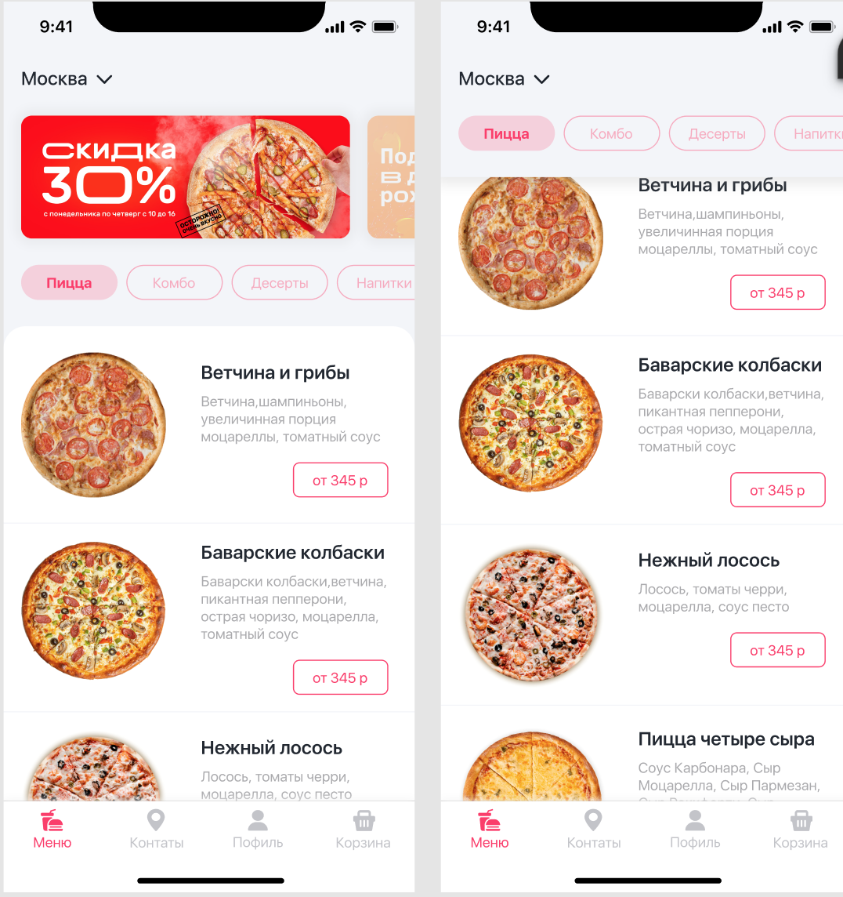

# Pizza-Store
## Оглавление
- **[Краткое описание](#Basic)**
- **[Презентация](#Presentation)**
- **[Задание](#Task)**

## Краткое описание
- Проект написан на **UIKit**
- Адаптивная верстка интерфейса **кодом**.
## Презентация

## Задание

- Реализовать главный экран для приложения доставки еды
- В баннеры можно захардкодить любые фото
- Основная задача - сделать идентичную планку с категориями и блок меню
- Планка с категориями при скролле должна прилипать к верхнему бару
- При нажатии на категорию, список должен пролистываться к соответствующему разделу
- В качестве API использовать любой открытый источник подходящий под текущие нужды
- Swift
- Clean Swift / VIPER / MVP
- UIKit
